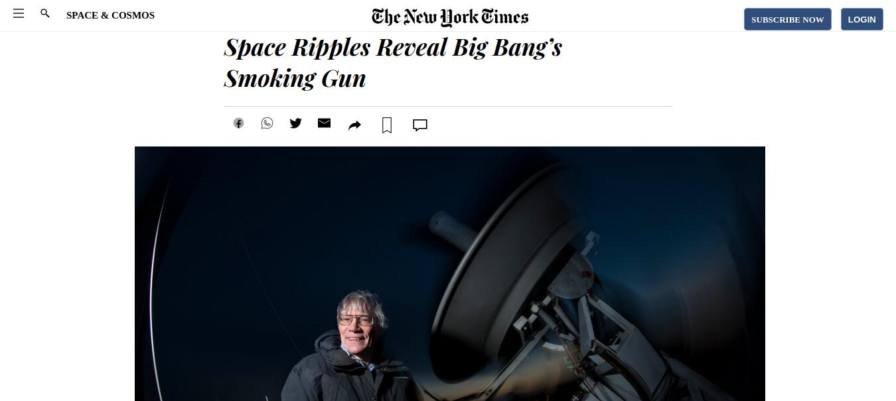

# New-York-Times-page Clone Project

> Using pure html and css, I have clone New Yorks Times web-page




## Built With

- HTML
- CSS
 

## Live Demo

[Live Demo Link](https://saretoduncan.github.io/NewYorkTimes/)


## Getting Started

To get a local copy, follow these simple example steps.

### Prerequisites

A computer with a working and up to date web browser.

### Setup

- Clone the repository to your folder of choice using Git (or just download all the files)
```
$ git clone https://github.com/saretoduncan/NewYorkTimes.git

```
- Open the index.html file (in the root folder) and the website should show up.

## Author

👤 **Author**

- GitHub: [@saretoduncan](https://github.com/saretoduncan)
- twitter [@duncan_sareto](https://twitter.com/duncan_sareto)


## 🤝 Contributing

Contributions, issues, and feature requests are welcome!

Feel free to check the [issues page](.github/ISSUE_TEMPLATE/feature_request.md).

## Show your support

Give a ⭐️ if you like this project!

## Acknowledgments

- Appreciation to  Microverse for giving me this opportunity to learn :)

## 📝 License

This project is [MIT](LICENCE) licensed.
